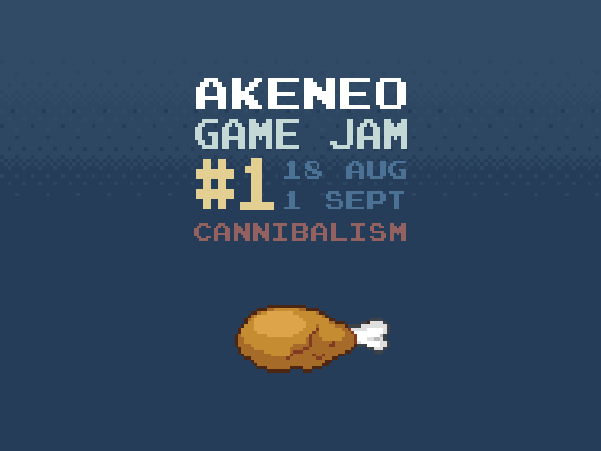

# Fast Food

Small explosive zombie game rushly developed #uglyCodeAndBugsInside with Phaser JS for the Akeneo Game Jam #1.

# Demo

You can access to the demo here https://nidup.github.io/fast-food/build/

Notice that it takes some time to boot, it downloads the whole internet.

# Install

npm install

# Run

npm run start

# Artwork and special thanks

Thx @grena for the Game Jam org!

Thx @belohlavek for the following boilerplate https://github.com/belohlavek/phaser-es6-boilerplate

Thx phaser for tile sprites and explosion audio http://phaser.io/examples/v2/games/invaders

Thx Curt for the Zombie Artwork http://opengameart.org/content/zombie-rpg-sprites

Thx rswhite for the explosion sprite http://rswhite.de/dgame5/?page=tutorial&tut=spritesheets

Thx K. Macleod for the audio http://incompetech.com/

Thx netgfx for the audio https://github.com/netgfx/Phaser-typewriter

Thx bart for the audio http://opengameart.org/content/25-spooky-sound-effects

Thx Russintheus for the audio http://www.freesound.org/people/Russintheus/sounds/165089/#

